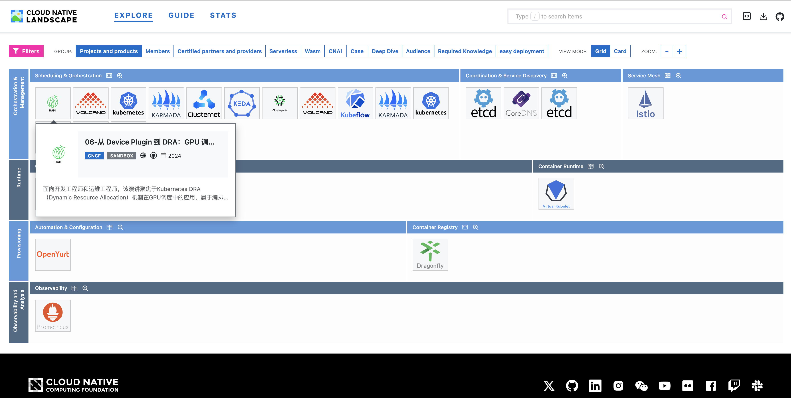
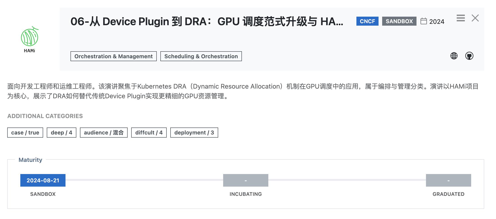

# KCDTopicVisualization

> KCD Topic Visualization Practice: Empowering Open Source Communities with AI Agents

## Introduction
This repository is my personal answer to the discussion I had with Keith at KCD 2026 Beijing.

It all started with one question: **How can we leverage AI Agents to empower open source communities?**

One direction is to "annotate presentation slides," and this repo is the outcome of that experiment.

Many thanks to Keith and Jintao for granting me (as the session "co-chair" of the Cloud Native track) access to the slide decks to conduct this experiment. Since public authorization was not obtained, the source PPT files are not included here.

In this project, I not only completed the visualization experiment but also practiced the Harness philosophy. The code was entirely generated by DeepSeek – I wrote none of it. Feel free to modify it and submit PRs.

In theory, the data can be replaced with any KCD or KubeCon topic set.

## Visualization 1 – Topic Overview


## Visualization 2 – Topic Details


## Design Principles

In the following steps, I will explain the **why**, **hard constraints**, and **soft constraints** for each part, and where possible, draw parallels to classic concepts from the "ancient code-by-hand" era.

As I shared with guests and community members at the KCD dinner: if possible, **do not write code manually**. Our role is to design the environment, clarify intent, build feedback loops, and leverage observability to guide AI debugging.

The core design principles of this project are:

**1. Minimal Control**  
Similar to the Autoresearch design, follow the "minimal control" principle – only impose control where necessary.

**2. Balance Between Hard and Soft Constraints**  
The experiment is governed by two types of rules: **hard constraints** enforced by system architecture, and **soft constraints** that guide agent decisions. Understanding these rules is key to interpreting experimental results and knowing the boundaries for modifications.

**3. Test-Driven Development**  
First define the final outcome, then design the hard and soft constraints backwards.

**4. Observability – Primarily via Logs**  
Given the small scale of this project, logs are sufficient to support observation and debugging.

**5. Back-of-the-Envelope Estimation – Cost Control**  
KCD is a one‑day event, KubeCon lasts three days. Taking KubeCon as an example: after the morning keynote, sessions start at 11:00, afternoon sessions start at 13:30. Each track has about 11 sessions per day; with 4 tracks that is roughly 44 sessions per day, totalling over 120 sessions for three days.

Since the tokens used in this experiment were personally funded (community tokens are often donated by enterprises and should be used sparingly), I tried to save wherever possible – spend where it matters. In extreme cases, analysis could even be done by copy‑pasting prompts in a browser. This project took a "browser‑oriented programming" approach to understand the Harness principles rather than fully automating token consumption. The final cost was only **0.9 RMB**, with tokens mostly used for PPT content analysis.

**6. Do Not Intervene Prematurely**  
You will see sections marked **Note** later, containing one "good example of not intervening prematurely" and one "bad foreshadowing of premature intervention" to illustrate the importance of this principle.

## Steps

### Step 1 – Convert PPT to Markdown

**Source of constraints** – Non‑functional requirement, cost control  
As a passion project, while we could directly feed the PPTs to a model for analysis, that approach would be a token burner. From a cost control perspective, the first step is to process the source files into plain text.

**Hard Constraints**  
1. Place all downloaded track PPTs into a single directory.  
2. Use a Python script to perform the conversion.  
3. Read PPT or PPTX files from the directory and save them in Markdown format.

**Soft Constraints** – Actually not too picky about perfection; not controlled in prompts  
After running the script generated by the model, there were some imperfections: based on the `pptx` Python library, the script additionally extracted images separately (though from a cost perspective we didn’t specify whether to process images or not). Also, the output contained many unnecessary line breaks. However, compared to the tokens consumed by a single image, the cost of these extra line breaks is acceptable.

**Verification**: Generate Markdown files.

**Result**: `ppt2md.py`

### Step 2 – Data Visualization

**Source of constraints** – Functional requirement, visualization

**Idea and Outcome**  
When it comes to data visualization, how can we present a dozen sessions in a track? Naturally, the CNCF Landscape gives us a dimension based on technology stacks. One of the goals of organizing events like KCD is to help the audience (including those watching recordings) quickly understand which technical areas the sessions cover and which specific projects are used.

After discussions with DeepSeek, I decided to position the sessions within the Landscape.  
Second, to help these sessions better address audience needs, we also need to evaluate whether there are concrete use cases, the technical depth (how easy it is to understand), target audience, complexity, etc.

With the general idea in place, constraints were added. The prompt framework for analyzing Markdown is as follows:

```
You are a senior cloud native technical expert.

I need your help to compare the following presentation content with the ${category} section of the CNCF landscape.
Provide judgments:
1. Is this talk related to ${category}?
   1.1 If related, describe the connection between the talk and ${category}.
   1.2 If related, does the talk include concrete use cases?
   1.3 If related, what is the technical depth of the talk? Does the audience need prerequisite technical background to understand it?
   1.4 If related, what is the primary target audience for this talk?
   1.5 If related, what is the technical or scenario complexity of this talk? How easy is it to practice?
2. Which specific CNCF projects are mentioned?
   2.1 If two or more projects are mentioned, what is the relationship between them in the talk?

Below is the content of the presentation:
${ppt_markdown_content}

Below is the introduction to ${category}:
${category_introduce}
```

Note that the first version of the prompt did not enforce structured output. The final version of the analysis approach includes mandatory constraints; it is not yet determined whether JSON structured output will be used.

**Verification**: Manually plug one or two sessions into the prompt template, run, and check the accuracy of the relevance judgments.

**Note**: I did not want to confirm the intermediate data format prematurely. We could directly place the DeepSeek results into the Landscape framework for visualization, thereby avoiding the need to build scaffolding for visualization. Although the mental inertia tends toward structured output and building an intermediate format interface, we need to practice the **Harness** philosophy and avoid intervening too early.

### Step 3 – Landscape

**Source of constraints** – Functional requirement, tool limitations

**Hard Constraints**  
```
landscape2 new --output-dir .
landscape2 build --data-file result.yml --settings-file settings.yml --guide-file guide.yml --logos-path ./hosted_logos --output-dir build
```
As validation, copy the existing logos from Landscape to ensure it runs properly.

**Soft Constraints**  
None

**Verification**: Run the project locally and verify it works.

### Step 4 – Data Relationship Organization

**Source of constraints** – Traditionally, this part is done by business analysts / product managers.

**Hard Constraints**  
1. Understand the Landscape data format, clarify which fields can be modified and what impacts those modifications have.  
   1.1 Understand how to add custom tags to Landscape.  
   1.2 Understand how the data is displayed.  
2. Avoid issues with the local Landscape environment.

**Soft Constraints**  
None

**Result**  
Configuration files like `guide.yml`, `prepare.yml`, `settings.yml`. Of course, `merge.py` also belongs to this step.

**Note**  
Here I over‑engineered and generated `template.yml`, which set the stage for later issues.

### Step 5 – Agent Processing

You can find the prompt in `agentprocess.py`, which is the final version from Step 2, along with the data format.

**Source of constraints** – Prompt content from Step 2, data relationships and disk structure from Step 4

**Hard Constraints**  
- Read content from Markdown files.  
- Obtain the list of projects and category descriptions from `prepare.yml`.  
- Replace the template prompt.  
- Invoke a model to process the prompt.  
- Save the results to a file.

**Soft Constraints**  
The model may hallucinate – for example, certain specific features (such as DRA) may not actually exist in the Landscape. Such constraints due to objective limitations are considered soft constraints.

**Result**  
`analysis_results.json`

### Step 6 – Result Processing

**Source of constraints** – Data relationships and disk structure from Steps 4 and 5

**Hard Constraints**  
- Read the analysis results from `analysis_results.json`.  
- Locate the original data for the session’s corresponding project in the Landscape YAML file.  
- Replace data used for display.  
- Append and write to `template.yml` to generate `result.yml`.

**Soft Constraints**  
Original content of the project as displayed in Landscape.

**Note – Debugging with Observability**  
The model kept confusing `template.yml` with the original data source, turning a simple append into a copy‑and‑update operation, which caused issues in displaying sessions and projects correctly. By having the model add **observability** logs, we eventually discovered this problem.

**Result**  
`result.yml`

### Step 7 – Deployment

Humans cannot directly talk to model weights; we need an Agent. At this point, we have discussed:
- The human role in visualization tasks: design the environment, clarify intent, build feedback loops.
- Agent + model: responsible for experimentation and implementation details.
- Tools that produce stable results: help us save tokens and provide stability constraints.
- Observability: provide a basis for discussion when the Agent + model go off track.

Next, we discuss deployment.

**Hard Constraints**  
- GitHub: provides free domain and Pages service.  
- Landscape: can be deployed on GitHub Pages.  
- GitHub Actions: for automation.

**Soft Constraints**  
None

**Result**  
[https://samyuan1990.github.io/KCDTopicVisualization/](https://samyuan1990.github.io/KCDTopicVisualization/)

## Summary

Back to the original question: **How can we leverage AI Agents to empower open source communities?**

Through this project, I attempted to provide one answer: let agents take on the tedious work of “translation” and “tagging,” connecting scattered presentation topics with the structured CNCF Landscape. Humans focus on design principles, defining constraints, building feedback loops, and intervening at key points with the help of observability.

The process does not aim for full automation, but rather **controllable, low‑cost, reusable** automation. I hope this experiment offers some inspiration on “how to collaborate with AI” in your own open source community practices.